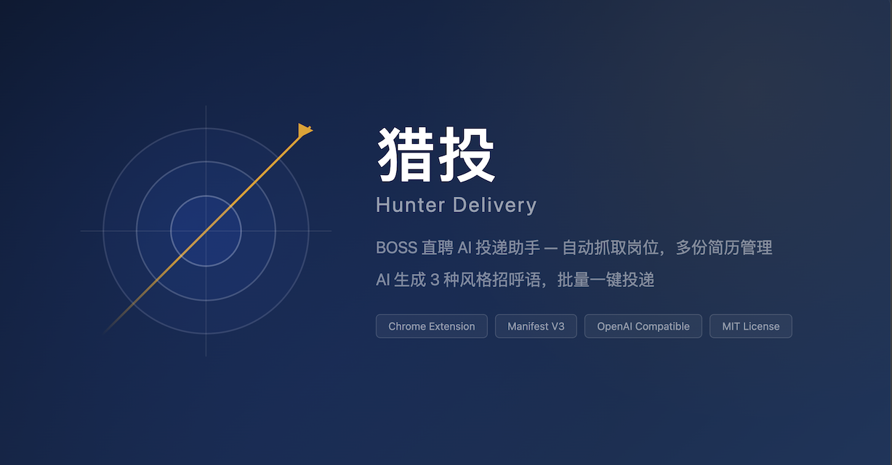

# 猎投 — BOSS 直聘 AI 投递助手




Chrome 扩展。自动读取 BOSS 直聘岗位信息，用 AI 对比简历生成个性化招呼语，支持单岗位确认发送与批量投递。

## 功能特性

- **自动读取岗位**：打开 BOSS 职位列表或详情页，插件自动抓取岗位名称、公司、薪资、完整 JD
- **多份简历管理**：支持创建最多 5 份简历（如产品方向、AI 方向），每份独立管理内容和写作要求
- **流式招呼语生成**：实时显示生成进度；当前岗位提供 3 种风格（直接匹配型 / 项目证据型 / 自然沟通型）供切换
- **流式简历解析**：上传简历图片，AI 实时提取完整内容
- **批量投递**：最多保留 20 个待处理岗位，批量生成与开始投递均以勾选为准，每个岗位保存 1 条可编辑招呼语，并绑定生成时使用的简历
- **投递成功确认**：成功送达的岗位卡片先显示打勾确认态，约 5 秒后自动消失，避免误以为未投出
- **可靠性保护**：按岗位 ID 和标题核验目标，处理 BOSS 正常沟通弹层；连续失败自动熔断
- **AI 兼容处理**：空响应自动重试并回退非流式请求；DeepSeek 默认关闭思考模式以降低等待时间
- **Token 用量显示**：服务商返回 usage 时，在当前岗位分析后显示消耗和费用估算
- **岗位库与导出**：投递记录自动归档，支持导出 Excel 兼容 CSV

## 安装

1. 从 [Releases](https://github.com/frogkingg/hunter-delivery/releases) 下载源码，或克隆本仓库
2. 打开 Chrome，访问 `chrome://extensions`
3. 开启右上角"开发者模式"
4. 点击"加载已解压的扩展程序"，选择本项目文件夹
5. 点击工具栏猎投图标，侧边栏打开即可使用

## 使用流程

1. **配置 AI**：在设置中填写 API 地址、模型和 API Key（支持 OpenAI 兼容接口），按需开启"关闭 DeepSeek 思考模式"，点击"测试连接"
2. **上传简历**：上传 JPG/PNG 简历图片，AI 流式提取完整内容，检查并保存
3. **浏览岗位**：打开 BOSS 职位详情或列表页，点击"加入投递清单"收集岗位
4. **单岗位分析**：点击"分析当前岗位并投递"，查看 JD 匹配结果，分析完成后会自动高亮"确认沟通并发送"按钮，在 3 种风格中选择或编辑后确认发送
5. **批量生成**：在投递清单先勾选岗位（或点"全选"），再点击"批量生成招呼语"，为所选岗位逐个生成 1 条可直接编辑的招呼语
6. **开始投递**：确认岗位、招呼语和绑定简历后，勾选要投递的岗位（或点"全选"），点击"开始投递"仅投递所选岗位；插件逐项打开详情、核验岗位并发送
7. **投递确认**：成功送达的岗位卡片会显示打勾确认态，约 5 秒后自动从清单消失，并记入岗位库
8. **查看记录**：成功投递的岗位记入岗位库，可导出 CSV

## 批量投递安全边界

- 批量生成与开始投递均以勾选为准：未勾选任何岗位时不会执行，需先选中或"全选"
- 岗位 ID 和岗位标题是硬核验条件，不一致时立即停止该岗位，避免误投
- 公司名称仅作为辅助一致性字段，兼容简称、集团名和详情页展示差异
- 遇到验证码、滑块、安全验证、访问异常或操作限制时不会自动绕过，需要手动处理
- 连续 3 个岗位失败时自动停止本轮投递
- 消息已确认送达但本地归档失败时，岗位进入"已发送待归档"，禁止自动重发
- 批量投递会使用后台标签页；请保持 Chrome 运行，并避免在投递过程中退出登录

## 常见问题

### 测试连接成功，但生成招呼语失败

- 连接测试是短请求，实际生成还包含简历、JD 和 JSON 输出要求
- DeepSeek 建议保持"关闭思考模式"开启
- 空响应会自动扩大输出额度重试；仍失败时可展开岗位查看"AI 原始返回"

### 失败岗位如何重新投递

- 展开岗位卡片，确认招呼语后点击"保存修改"，即可恢复为待投递
- 也可以重新点击"批量生成招呼语"
- "已发送待归档"表示消息已经送达，不应重新发送

### BOSS 页面出现弹层或安全验证

- "已向 BOSS 发送消息 / 继续沟通"属于正常沟通弹层，插件会自动处理
- 安全验证或操作限制不会被绕过，请先在 BOSS 页面手动完成，再重新执行

## 技术栈

- Chrome Manifest V3
- ES Modules（无框架依赖）
- OpenAI 兼容 API
- Rollup 打包

## 开发

```bash
npm install        # 安装依赖
npm run check      # 语法检查
npm test           # 运行测试（当前 104 个）
npm run build      # 生产构建
npm run dev        # 开发模式（watch）
```

## 隐私说明

- 简历图片、简历全文和岗位 JD 会发送到你配置的 AI 服务地址，用于解析和生成
- 已保存的简历图片会在你确认沟通或启动批量投递后发送到对应的 BOSS 会话
- API Key 以明文保存在本机 Chrome 扩展存储中
- 除你配置的 AI 服务和你主动投递的 BOSS 会话外，扩展不会把数据发送给开发者服务器
- 配置、简历、队列、岗位库和投递日志保存在本机 Chrome 扩展存储中
- 建议使用可随时废止的低额度 API Key
- AI 服务地址强制要求 HTTPS，拒绝本地/内网地址

## 免责声明

本扩展为第三方工具，与 BOSS 直聘无任何关联。使用本扩展可能违反 BOSS 直聘的使用条款，请自行评估风险。作者不承担因使用本扩展导致的任何账号封禁或其他后果。

## License

MIT
