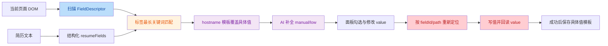
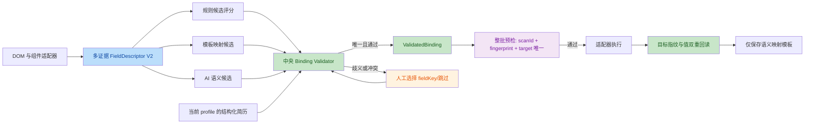

# 智能填充字段错位问题分析与解决方案

> 状态：已批准并实施
> 日期：2026-08-03
> 范围：问题分析、方案设计与实施验收

## 1. 结论摘要

“手机号输入框填入姓名”不是单一关键词配置错误，而是当前链路缺少统一的字段绑定契约。扫描、匹配、AI、模板和填充执行各自维护局部状态，但没有共同保证以下三个不变量：

1. **目标身份不变量**：填充时的 DOM 控件必须仍是扫描时识别的同一个逻辑字段。
2. **语义和值不变量**：所有规则、AI、模板和人工修正都必须通过同一套字段类型、值来源、选项及上下文校验。
3. **会话不变量**：填充计划只能作用于生成该计划的标签页、文档和表单版本。

当前版本虽然已经修复了“旧 DOM 引用失效”和“手机号区号下拉”两个具体场景，但仍可稳定复现以下静默错填：

- DOM 插入或排序变化后，姓名写入新增字段、手机号写入姓名字段，两个操作均报告成功。
- Ant Design 日期范围内两个输入框共享同一容器定位，结束时间覆盖开始时间，两个操作均报告成功。
- 规则层已经拒绝“姓名值写入 tel 控件”，AI 合并后可以把它重新提升为可自动填充并成功写入。
- 站点模板会跨简历复用旧姓名/手机号；多个同名“学校”字段会全部套用模板中的第一条记录。
- “紧急联系人姓名/电话”会被独立关键词规则映射为候选人本人的姓名/手机号。

因此，不建议继续以增加关键词、增加局部格式正则或修补单一站点选择器的方式迭代。最终方案应改为：

**多证据字段识别 + 中央绑定校验 + 可验证的复合定位 + 扫描会话隔离 + 仅记忆语义映射的模板。**

这里的“彻底解决”定义为：在支持范围内，不允许系统静默把值写入未经验证的目标；无法唯一识别时明确降级为人工确认。对于任意未知页面结构，不能承诺 100% 自动填写覆盖率，但可以通过失败关闭保证“不确定时不乱填”。

## 2. 审查范围与方法

本次已完整审阅：

- 设计与计划：`docs/superpowers/specs/2026-08-03-smart-fill-design.md`、`docs/superpowers/plans/2026-08-03-smart-fill.md`
- 用户与测试文档：`docs/智能填充使用说明.md`、`docs/智能填充真站测试手册.md`、`docs/智能填充测试报告.md`
- 扫描与执行：`fill-content.js`
- 字段与匹配：`src/form-fields.js`、`src/matcher.js`
- 简历数据：`src/resume-fields.js`
- 面板与状态：`src/fill-ui.js`、`src/state.js`、`src/config.js`
- 模板、日志与消息：`src/site-templates.js`、`src/fill-log.js`、`src/chrome-helpers.js`、`src/messages.js`
- 全部智能填充单元测试、5 个 HTML 夹具和集成测试
- 最近三个相关修复提交：`421d4b8`、`ad2f3e3`、`b01a024`

验证方法包括：

- 静态调用链和数据流审查
- 设计规格与实际实现对照
- Git 历史差异审查
- 现有 `npm run check && npm test` 全量回归
- 针对 DOM 重排、复合控件、AI 合并和模板复用的最小复现实验

当前基线：语法检查通过，183 项测试全部通过。本文列出的问题仍能复现，说明现有测试通过不等于错位风险已经闭环。

两个独立代码审查线程对下述 7 项根因进行了二次核验，7/7 均确认存在，未发现误报。其中字段身份、复合控件、AI 校验绕过、模板值污染和陈旧会话被评为高严重度；单标签匹配和 UI 无法纠正语义被评为中严重度。

方案实施后，全量测试增至 198 项并全部通过；`npm run check` 与 `npm run build` 通过，生产构建已包含独立的 `dist/fill-content.js`。新增回归覆盖 DOM 插入/重排、React 节点替换、日期范围 slot、错误 scanId/字段指纹、AI 校验绕过、Template V2、紧急联系人和重复经历 ValueRef。

## 3. 当前架构与数据流

### 3.1 模块职责

| 阶段 | 当前模块 | 当前输出 |
|---|---|---|
| 简历结构化 | `src/resume-fields.js` | 扁平标量字段 + education/internships/projects 数组 |
| DOM 扫描 | `fill-content.js` | `FieldDescriptor[]` + content 内部 `elementRegistry` |
| 规则匹配 | `src/matcher.js` | `MatchResult[]` |
| 模板覆盖 | `src/site-templates.js` | 以 hostname 保存并覆盖具体值 |
| AI 兜底 | `src/matcher.js` / `src/fill-ui.js` | 把 manual/low 结果改为 match |
| 面板预览 | `src/fill-ui.js` | 勾选状态与可编辑值 |
| DOM 填充 | `fill-content.js` | 按 fieldId 查 registry，重新定位后写值并回读 |

### 3.2 当前技术流



### 3.3 当前核心算法

当前规则匹配对每个 DOM 字段独立执行：

1. 从一个最终标签字符串中删除空白、必填、标点等噪声。
2. 遍历规范字段字典，查找标签中命中的最长关键词。
3. 最长关键词对应的规范字段成为唯一候选。
4. 从 `resumeFields[fieldKey]` 取值。
5. 对 checkbox、select/radio、tel/email/date 做部分格式或选项校验。
6. 通过则自动填充，否则标记 manual。
7. AI 可再次处理 manual 或低置信字段。

实现与设计规格存在一个关键偏差：设计规格描述“关键词长度 + 类型兼容性打分”，实际实现只用最长关键词决定字段，类型兼容仅在取值后做少量拒绝校验，并不参与候选排序。

## 4. 根因分析

| 编号 | 根因 | 严重度 | 是否可静默错填 |
|---|---|---|---|
| 1 | DOM path 被误当作字段身份 | P0 | 是 |
| 2 | 复合控件多个字段共享同一执行目标 | P0 | 是 |
| 3 | AI 合并绕过规则层安全校验 | P0 | 是 |
| 4 | 模板跨 profile/重复字段复用具体值 | P0 | 是 |
| 5 | 单标签最长子串丢失上下文 | P1 | 是 |
| 6 | 扫描与填充无会话隔离 | P1 | 是 |
| 7 | UI 不能修正 fieldKey | P1 | 间接放大 |

### 4.1 P0：DOM path 不是字段身份，重排后会静默写错目标

**证据**

- [`fill-content.js:118-139`](../fill-content.js#L118-L139) 使用结构链和 `:nth-of-type()` 生成 path。
- [`fill-content.js:413-422`](../fill-content.js#L413-L422) 重新定位时直接接受 `querySelector(path)` 返回的第一个 connected 元素。
- [`fill-content.js:406-410`](../fill-content.js#L406-L410) 回读只判断该元素是否包含期望值，不验证它是否仍是原字段。

**复现**

扫描包含“姓名、手机号”的两个无稳定 id/name 字段后，在表单头部插入一个同级字段，再执行原填充计划：

| 操作 | 实际结果 |
|---|---|
| 姓名 = 张三 | 写入新插入字段 |
| 手机号 = 13800138000 | 写入原姓名字段 |
| 原手机号字段 | 保持空值 |
| 执行结果 | 两项均 `ok: true` |

**根因**

path 只描述“扫描时的位置”，不描述“字段是谁”。最近的修复能处理“同位置节点被 React 替换”的情况，但不能处理插入、删除、排序、条件渲染、分步表单和 SPA 切换。只要旧 path 指向另一个仍连接的元素，系统就会把它当成正确目标。

### 4.2 P0：自定义复合控件共享容器定位，多个字段实际写入同一 input

**证据**

- [`fill-content.js:174`](../fill-content.js#L174) 扫描所有 input/select/textarea。
- [`fill-content.js:220-240`](../fill-content.js#L220-L240) 自定义控件内每个 input 都生成一个字段，但 path 都指向同一个 customContainer。
- [`fill-content.js:451-460`](../fill-content.js#L451-L460) 填充 custom-date 时始终使用 `container.querySelector("input")`。

**复现**

一个 `.ant-picker-range` 容器包含“项目开始时间”和“项目结束时间”两个 input：

- 扫描得到两个不同 fieldId。
- 两个描述符的 path 完全相同。
- 依次填入 `2024-01`、`2024-12`。
- 第一个 input 最终为 `2024-12`，第二个 input 为空。
- 两次填充均返回成功。

**根因**

扫描层把“DOM input”和“逻辑组件”混合建模。复合组件既没有去重，也没有 slot 概念，导致两个业务字段共享一个执行目标。

### 4.3 P0：AI 合并绕过规则层安全校验

**证据**

- [`src/matcher.js:47-57`](../src/matcher.js#L47-L57) 定义了格式兼容校验。
- [`src/matcher.js:103-106`](../src/matcher.js#L103-L106) 仅规则匹配调用该校验。
- [`src/matcher.js:111-128`](../src/matcher.js#L111-L128) AI 合并只校验 fieldKey 是否存在和值是否非空，随后直接设置 `status: "match"`。
- [`src/fill-ui.js:224-231`](../src/fill-ui.js#L224-L231) 面板把所有 manual/low 项送入 AI 并直接应用结果。

**复现**

1. tel 控件被扫描为标签“姓名”。
2. 规则层识别 `fieldKey=name`，并因姓名格式不符合 tel 而正确降级 manual。
3. AI 返回相同的 `fieldKey=name, value=张三`。
4. `applyAiResults` 把结果重新提升为 match。
5. HTML `input[type=tel]` 接受任意字符串，执行层写入“张三”并回报成功。

同一漏洞也允许 AI：

- 覆盖 skipped 控件的拒绝状态。
- 绕过 select/radio options 校验。
- 返回不等于当前简历字段的编造值。
- 绕过手机号区号推导的 manual 结果。

**根因**

规则、AI、模板各自直接生成最终 MatchResult，没有唯一的中央校验出口。

### 4.4 P0：站点模板记忆的是具体值，不是字段映射

**证据**

- [`src/site-templates.js:11-20`](../src/site-templates.js#L11-L20) 模板持久化 `fieldKey + siteLabel + path + value`。
- [`src/site-templates.js:24-39`](../src/site-templates.js#L24-L39) 套用时用 `find(siteLabel + fieldKey)` 取第一项并直接覆盖当前值。
- [`src/fill-ui.js:218-224`](../src/fill-ui.js#L218-L224) 规则匹配后立即按 hostname 套模板。
- [`src/fill-ui.js:351-362`](../src/fill-ui.js#L351-L362) 填充成功后保存实际填写值。
- [`src/matcher.js:64`](../src/matcher.js#L64) MatchResult 没有传播 descriptor 的 path，真实流程保存的 path 实际为空。

**复现**

- 简历 A 在 `apply.example.com` 保存“姓名=张三”。
- 切换到简历 B，规则结果为“姓名=李四”。
- 模板按相同 hostname、标签和 fieldKey 把值覆盖回“张三”。

重复字段场景：

- 模板中有两项 `fieldKey=school, siteLabel=学校`，值分别为本科院校、硕士院校。
- 新页面两个“学校”字段都通过 `.find()` 命中第一项。
- 两个字段均被填入本科院校。

**根因**

模板把 profile 相关的 PII 当成了站点结构知识，并且忽略已存储的 path。hostname 粒度也无法区分同站不同表单、不同步骤和重复字段。

### 4.5 P1：字段识别只保留单一标签，最长子串会把上下文语义丢失

**证据**

- [`fill-content.js:54-116`](../fill-content.js#L54-L116) 标签提取按固定优先级返回第一个来源，不保留其他证据。
- [`src/matcher.js:79-107`](../src/matcher.js#L79-L107) 匹配只用 `field.label` 的最长关键词。
- [`src/form-fields.js:7-71`](../src/form-fields.js#L7-L71) 字典包含“姓名、电话、地址、公司”等宽泛关键词。

**复现**

| 页面标签 | 当前映射 | 当前状态 | 实际应对 |
|---|---|---|---|
| 紧急联系人姓名 | 候选人姓名 | match | 不应自动填本人姓名 |
| 紧急联系人电话 | 候选人手机号 | match | 不应自动填本人手机号 |

当前算法没有使用：

- `id`、`name`、`autocomplete`、`inputmode`、`data-*`
- 所属 section/group/fieldset/legend
- 所有 label/aria/placeholder 证据及其可信权重
- 负向上下文，如“紧急联系人、推荐人、父母、证明人”
- 候选第一名与第二名的分差
- 重复行、复合字段和字段间关系

格式校验只能保护少数强类型控件。大多数网申字段是 `type=text`，语义错配后仍会正常写入并通过回读。

### 4.6 P1：扫描与填充没有会话隔离

**证据**

- [`src/state.js:15-23`](../src/state.js#L15-L23) 只存 fields/page/matches，没有 tabId、documentId、scanId 或 form fingerprint。
- [`src/fill-ui.js:192-208`](../src/fill-ui.js#L192-L208) 扫描后只保存字段和页面信息。
- [`src/fill-ui.js:289-305`](../src/fill-ui.js#L289-L305) 填充时重新查询当前 tab，没有验证它是否是扫描 tab。
- [`src/messages.js:111-120`](../src/messages.js#L111-L120) 消息协议没有 scanId/page fingerprint。
- [`fill-content.js:11`](../fill-content.js#L11) content 只保存一份全局 elementRegistry。

**影响**

用户扫描后切换标签页、SPA 路由变化、表单进入下一步或异步重建时，面板仍可发送旧 fieldId。多数情况下会报“字段未找到”，但如果旧 path 在新结构中仍能解析，就可能写入错误字段。

### 4.7 P1：UI 只能改值，不能纠正字段语义

**证据**

- [`src/fill-ui.js:266-279`](../src/fill-ui.js#L266-L279) manual 行的 checkbox 和 value 输入均禁用。
- [`src/fill-ui.js:462-465`](../src/fill-ui.js#L462-L465) 用户编辑只更新 `fillValues[fieldId]`。

**影响**

- 用户不能把“姓名”字段改绑为“紧急联系人姓名”或明确设为跳过。
- 用户不能对 manual 行选择正确的 resume field。
- 文档所述“可直接修改任意行建议值”与实现不一致。
- 模板只能学习一个被编辑过的 literal value，学不到正确 fieldKey/ValueRef。

## 5. 为什么现有修复仍不充分

### 5.1 `ad2f3e3`：填充前按 path 重查

该修复正确解决了“React 用同结构新节点替换旧节点”时写入 detached node 的问题，也降低了一个容器标签被多个控件复用的风险。

未覆盖：

- 同级节点插入、删除或重排。
- path 指向另一个 connected 元素。
- custom range 多 input 共享 path。
- 页面/标签页/表单版本变化。
- 目标元素语义指纹校验。

### 5.2 `b01a024`：手机号区号与格式校验

该修复正确处理了常见国家区号 select，并在规则层阻止姓名进入 tel/email/date。

未覆盖：

- AI 和模板绕过格式校验。
- `type=text` 的手机号、姓名、地址等错配。
- 候选人字段与紧急联系人字段的上下文冲突。
- DOM 目标本身已错位时，格式正确的值写进错误文本框。

## 6. 目标方案

### 6.1 设计原则

1. **正确性优先于覆盖率**：不唯一、不兼容、不新鲜的绑定一律不自动填。
2. **字段身份与 CSS 位置分离**：path 只能是定位候选之一，不能作为身份本身。
3. **所有来源走同一校验出口**：规则、AI、模板、人工修改不能绕过中央校验。
4. **AI 只判断语义，不提供最终值**：最终值必须由受信任的 ValueRef 从当前简历解析。
5. **模板只保存映射知识，不保存通用 PII 值**。
6. **复合控件按逻辑 slot 建模**：一个字段对应一个明确 target。
7. **成功必须可证明**：成功结果同时证明目标身份正确和值已生效。

### 6.2 目标数据流



## 7. 新数据契约

### 7.1 FieldDescriptor V2

```js
{
  scanId: "uuid",
  fieldId: "scan-local-id",
  control: {
    adapter: "native-input|native-select|radio-group|antd-select|antd-date-range|element-select|generic-aria",
    kind: "text|tel|email|date|select|radio|checkbox|textarea",
    slot: "single|start|end|0|1",
  },
  evidence: [
    { source: "label-for", text: "手机号", normalized: "手机号", weight: 100 },
    { source: "name", text: "mobile", normalized: "mobile", weight: 80 },
    { source: "autocomplete", text: "tel", normalized: "tel", weight: 100 },
    { source: "section", text: "基本信息", normalized: "基本信息", weight: 40 },
  ],
  context: {
    formKey: "application-basic-info",
    section: "基本信息",
    group: "联系方式",
    repeatPath: null,
  },
  attributes: {
    tag: "input",
    inputType: "tel",
    id: "mobile",
    name: "mobile",
    autocomplete: "tel",
    inputmode: "tel",
  },
  options: [{ label: "+86", value: "+86" }],
  locators: [
    { kind: "id", value: "mobile", score: 100 },
    { kind: "name", value: "mobile", formKey: "application-basic-info", score: 90 },
    { kind: "css", value: "...", score: 30 },
  ],
  fingerprint: "sha256/stable-hash",
  required: true,
  skipped: false,
}
```

关键变化：

- 保留全部证据，不再提前压缩成一个 label。
- `fingerprint` 由稳定属性、语义证据、组件类型、slot、选项摘要和上下文生成。
- 位置型 CSS 只作为低权重 fallback locator。
- 复合控件用 adapter + slot 区分目标 input。

### 7.2 ValidatedBinding

```js
{
  scanId: "uuid",
  fieldId: "scan-local-id",
  fieldFingerprint: "...",
  fieldKey: "phone",
  valueRef: { source: "resume", path: "phone" },
  resolvedValue: "13800138000",
  source: "rule|template|ai|manual",
  confidence: 0.98,
  evidence: ["label-for:手机号", "name:mobile", "type:tel"],
  userConfirmed: false,
  status: "ready|manual|skip|stale",
}
```

`resolvedValue` 只用于当前填充会话。持久化模板保存 `valueRef`，不保存该值。

### 7.3 Template V2

```js
{
  schemaVersion: 2,
  scope: {
    origin: "https://apply.example.com",
    formSignature: "...",
    routePattern: "/jobs/*/apply",
  },
  mappings: [{
    fieldFingerprintPattern: "...",
    fieldKey: "phone",
    valueRef: { source: "resume", path: "phone" },
    optionMap: null,
    userConfirmed: true,
  }],
  updatedAt: "...",
}
```

模板规则：

- 不保存姓名、手机号等具体值。
- 同标签重复字段必须由 fingerprint/context/repeatPath 区分。
- profile 切换时重新解析 valueRef，不复用旧 profile 值。
- formSignature 不匹配时模板只作为低权重候选，不直接自动应用。
- 旧版模板标记为 legacy，不再自动套用其 value；建议一次性失效并提示重新扫描确认。

## 8. 字段匹配算法

### 8.1 候选生成

对每个字段，从以下证据生成规范字段候选：

- 强证据：`autocomplete`、label-for、aria-label、明确的 id/name token。
- 中证据：fieldset/legend、form-item label、section/group 标题、组件选项集合。
- 弱证据：placeholder、title、邻近文本、位置型 selector。
- 约束证据：input type、inputmode、组件 adapter、options、required。
- 负向证据：紧急联系人、推荐人、监护人、父母、证明人、公司联系人等上下文。

### 8.2 评分与拒绝

建议把权重配置化，初始规则如下：

- 强语义精确命中：高权重。
- 多个独立证据一致：加分。
- 控件类型、autocomplete、值格式兼容：硬门槛或加分。
- 负向上下文冲突：大幅扣分或直接排除候选。
- Top 1 低于自动填充阈值：manual。
- Top 1 与 Top 2 分差不足：manual。
- label 与 name/id/autocomplete 明显冲突：manual。
- skipped、选项不匹配、值来源不可信：禁止自动填充。

置信度不再由关键词长度直接换算，而由归一化得分、候选分差和证据独立性共同决定。

### 8.3 中央校验

新增唯一入口：

```js
validateBinding(fieldDescriptor, candidate, resumeFields, context)
  -> { ok, binding?, reasonCode?, diagnostics? }
```

所有来源必须经过该函数：

- 规则候选
- 模板候选
- AI 候选
- 用户选择 fieldKey
- 用户输入 literal value

中央校验至少执行：

- 控件是否 skipped
- fieldKey 是否允许
- valueRef 是否存在于当前 profile
- AI 返回值是否与 valueRef 解析值一致；更推荐 AI 不返回 value
- 字段级格式校验
- 控件类型兼容
- select/radio options 兼容
- 上下文冲突检查
- 重复目标检查
- 自动填充阈值和候选分差

### 8.4 AI 兜底

AI 请求只包含必要的结构化证据，不发送可由本地规则解决的字段。AI 输出改为：

```json
{
  "fieldId": "f-12",
  "fieldKey": "phone",
  "confidence": 0.86,
  "reasonCodes": ["label_semantics", "tel_type"]
}
```

AI 不返回最终 value。面板根据 `fieldKey` 从当前简历取值，再走中央校验。AI 不能：

- 把 skipped 字段变为 ready。
- 覆盖强规则冲突。
- 绕过 options/格式校验。
- 编造简历不存在的值。

## 9. DOM 定位与填充执行

### 9.1 逻辑控件适配器

在 `fill-content.js` 内引入适配器层：

- NativeInputAdapter
- NativeSelectAdapter
- RadioGroupAdapter
- CheckboxAdapter
- AntSelectAdapter
- AntDatePickerAdapter
- AntDateRangeAdapter
- ElementSelectAdapter
- ElementDateAdapter
- GenericAriaComboboxAdapter

每个适配器负责：

- 判定一个逻辑控件的 root。
- 枚举明确的 slot。
- 提取 options 与当前值。
- 生成 locator bundle 和 fingerprint。
- 定位具体写入 target。
- 写入与回读。

扫描时按 root + slot 去重。禁止多个 descriptor 默认落到同一 target。

### 9.2 可验证定位

定位流程：

1. 缓存引用仍 connected 且 fingerprint 一致时直接使用。
2. 否则用全部 locator 找候选，不使用单次 `querySelector` 直接定案。
3. 对候选重新计算 fingerprint 相似度。
4. 只有一个候选超过阈值且与第二名有足够分差时才接受。
5. 位置型 path 命中但 fingerprint 不一致时返回 `STALE_TARGET`，不写值。

### 9.3 扫描会话

`SMART_FILL_SCAN` 返回：

```js
{
  scanId,
  documentUrl,
  documentFingerprint,
  formFingerprint,
  fields,
}
```

面板同时把发起扫描时已有的 `tab.id` 记录到 ScanSession，不依赖 content 回传 tabId。`SMART_FILL_APPLY` 必须发送到该 tab，并携带同一 `scanId`、文档指纹和每个字段指纹。content 维护当前 ScanSession，并使用 MutationObserver 监听表单结构变化：

- 仅值变化不使会话失效。
- 控件增删、关键属性变化、组件 root 替换时标记 stale。
- Apply 前先比较 scanId、URL、document/form fingerprint。
- stale 时整批 0 写入并要求重新扫描。

面板固定扫描时的 tabId。填充时不重新选择任意 active tab。

### 9.4 两阶段执行

**阶段 1：整批预检**

- 校验会话新鲜度。
- 解析每个 target。
- 比较字段 fingerprint。
- 验证值格式和 options。
- 检查多个 operation 是否解析到同一 target。
- 任一 P0 冲突时整批不写入。

**阶段 2：顺序提交**

- 每项写入前再次确认 target。
- 使用原生 setter 和框架兼容事件。
- 自定义下拉通过 `aria-controls/aria-owns` 绑定自己的 listbox，禁止全局选择任意可见 option。
- 写入后校验“目标指纹仍一致 + 业务值已生效”。
- 组件重渲染导致会话 stale 时停止剩余字段。

成功响应增加：

```js
{
  id,
  ok,
  resolvedFingerprint,
  verification: "exact|normalized|adapter",
  errorCode,
}
```

## 10. 面板交互调整

每个识别结果应提供：

- 页面字段标签与控件类型
- 当前绑定的简历字段
- 建议值
- 证据摘要与置信度
- “选择简历字段”搜索下拉
- “手动输入值”
- “跳过此字段”
- “在页面定位”高亮

manual 行不再完全禁用。用户可以明确选择 fieldKey，选择后仍走中央校验。对格式冲突的手工 literal value：

- 默认不允许自动填充。
- 用户可在明确风险提示下单次确认。
- 不作为跨 profile 的通用站点模板值保存。

用户确认过的语义映射可以进入 Template V2，成为下次候选；模板不直接覆盖当前 profile 的实际值。

## 11. 关键代码修改点

| 文件 | 修改重点 |
|---|---|
| `fill-content.js` | 新增 ScanSession、组件适配器、root+slot 去重、多 locator 解析、fingerprint 校验、MutationObserver、整批预检、重复 target 检测 |
| `src/form-fields.js` | 字段 schema 增加 aliases、负向上下文、允许控件类型、值校验器、autocomplete/name token |
| `src/matcher.js` | 改为多证据候选评分；新增统一 `validateBinding`；AI 只返回 fieldKey；所有来源共享校验 |
| `src/resume-fields.js` | 提供 `resolveValueRef` 与字段级校验；重复经历支持数组路径，不只聚合最新一条 |
| `src/site-templates.js` | 升级 Template V2；保存 mapping/valueRef，不保存通用具体值；按 form fingerprint 匹配；legacy 失效迁移 |
| `src/fill-ui.js` | 保存 tabId/scanId；支持改 fieldKey、skip、manual value；profile 切换后重算计划；Apply 携带指纹 |
| `src/state.js` | 新增 scanSession、bindings、diagnostics、dirty/stale 状态 |
| `src/messages.js` | 升级 scan/apply 协议，加入 scanId、document/form fingerprint、operation fingerprint |
| `src/chrome-helpers.js` | 允许向指定扫描 tabId 发送，不在 Apply 时重新选择当前 tab |
| 测试文件 | 增加错位不变量、AI/模板对抗、DOM 变异、复合控件和 stale session 测试 |

## 12. 实施步骤

### 阶段 1：先锁定安全不变量

新增失败测试，完整覆盖本文复现：

1. DOM 同级插入、删除、排序后旧计划 0 写入。
2. Ant DateRange 两个 slot 写入各自 input。
3. AI 不能把“姓名 → tel”从 manual 提升为 match。
4. skipped/options/格式冲突不能被 AI 或模板绕过。
5. profile 切换后模板解析当前 profile 值。
6. 重复“学校”字段不会全部命中第一条模板。
7. 紧急联系人字段不自动填候选人本人信息。
8. tab/SPA/form fingerprint 变化时 Apply 整批拒绝。

### 阶段 2：升级 FieldDescriptor 与 ScanSession

- 引入 evidence、context、locator bundle、fingerprint、adapter、slot。
- 扫描按 root + slot 去重。
- 保留 v1 字段用于 UI 兼容，内部转为 V2。
- 消息协议加入 scanId 和 page/form fingerprint。

### 阶段 3：重构匹配与中央校验

- 把单标签最长子串改为候选评分。
- 实现字段 schema validators 和负向上下文。
- 所有规则结果经 `validateBinding`。
- AI 改为只返回 fieldKey，并复用同一校验。

### 阶段 4：升级模板和人工修正

- Template V2 只保存映射。
- legacy 模板不自动套值。
- manual 行支持选择 fieldKey/skip。
- profile 切换、简历修改后重新 resolve valueRef。

### 阶段 5：升级执行引擎

- 整批预检。
- 多 locator + fingerprint 唯一解析。
- 自定义组件 adapter 执行。
- MutationObserver 使旧会话失效。
- 成功回报包含 target fingerprint。

### 阶段 6：回归、性能与真站验证

- 全量单元与集成测试。
- 增加 Ant/Element 日期范围、级联选择、重复教育经历、紧急联系人、动态插入等夹具。
- 按真站手册验证至少 5 个不同系统，建议扩大到 10 个。
- 更新设计规格、使用说明、测试报告和 README。

## 13. 测试与验收标准

### 13.1 正确性

| 指标 | 验收 |
|---|---|
| 成功操作目标一致性 | 每个 `ok:true` 的 resolvedFingerprint 必须等于预期 fingerprint，100% |
| DOM 变异错填 | 插入/删除/重排/替换/SPA 用例中静默错填为 0 |
| 重复 target | 预检识别率 100%，未显式允许时整批拒绝 |
| AI 绕过 | skipped、格式、options、上下文冲突全部保持 manual/skip |
| 模板跨 profile 污染 | 0，模板不保存并复用旧 profile 的实际值 |
| 重复标签模板错配 | 0，必须按 fingerprint/context 唯一区分 |
| stale session | 0 写入，并明确提示重新扫描 |

### 13.2 匹配质量

准确率与覆盖率分开统计：

- 自动填充 precision 目标不低于 99.5%。
- 识别不确定字段计入 manual，不以降低安全阈值换覆盖率。
- 常见基础字段在稳定结构中的自动覆盖率不低于现有基线。
- 对抗集必须包含紧急联系人、推荐人、父母、公司联系人、重复经历和中英文混合标签。

### 13.3 性能

建议建立 300 控件基准页：

- 本地扫描与证据提取 P95 小于 100 ms。
- 本地规则匹配 P95 小于 30 ms。
- MutationObserver 100-200 ms 防抖，只在结构变化时重算 fingerprint。
- locator 先走 id/name 索引，避免每个字段全 DOM 扫描。
- AI 仅处理本地仍歧义的字段，并批量调用一次。
- 不增加同步长任务，不改变当前逐字段节流策略。

### 13.4 兼容性

- 保持 Chrome MV3。
- 保留原生 setter + input/change/blur 事件机制。
- 覆盖原生控件、Ant Design、Element、ARIA combobox。
- iframe、Shadow DOM、验证码、滑块继续作为明确边界；检测到时提示人工处理。

## 14. 迁移与风险控制

### 14.1 存储迁移

- 新模板使用 `schemaVersion: 2` 和独立 storage key，或在原 key 内版本化。
- v1 模板中的具体 value 不自动迁移为可执行值。
- 可保留 host/label/fieldKey 作为低置信候选，但必须经用户确认和 V2 校验。
- 提供一次性清理 legacy 模板的入口。

### 14.2 协议迁移

- scan/apply 协议同时升级，避免新 panel 与旧 content 混用。
- content 注入后返回 engineVersion。
- 版本不匹配时重新注入或提示刷新扩展，不执行旧计划。

### 14.3 实施风险

| 风险 | 控制 |
|---|---|
| 自动覆盖率短期下降 | UI 提供快速字段选择；收集已确认映射扩充规则 |
| 组件库差异较大 | adapter 插件化，generic ARIA 作为保守 fallback |
| fingerprint 过严导致频繁 stale | 区分稳定语义属性与易变 class；阈值用变异测试校准 |
| 旧模板失效影响体验 | 一次性说明并允许用户快速重新确认，不继续复用不可信具体值 |

## 15. 推荐决策

建议批准完整方案，按“测试锁定不变量 → V2 描述符与会话 → 中央校验 → 模板迁移 → 执行适配器”的顺序实施。

不建议只做以下局部修复：

- 继续增加手机号/姓名格式正则。
- 继续增加特定站点 CSS selector。
- 仅把 `querySelector` 改为更多 fallback selector。
- 仅扩充关键词数据集。
- 仅在填充后检查 value。

这些措施可以降低单点失败率，但无法建立跨扫描、匹配、AI、模板和执行的正确性保证。
