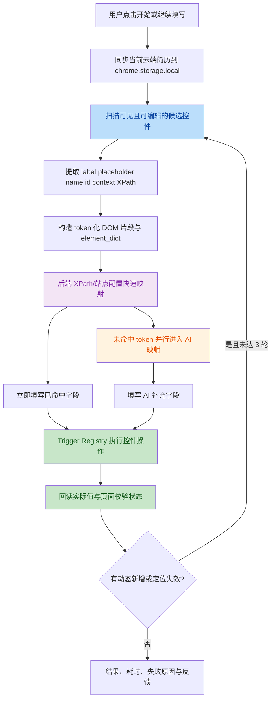
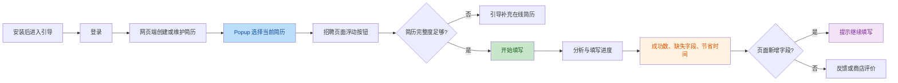
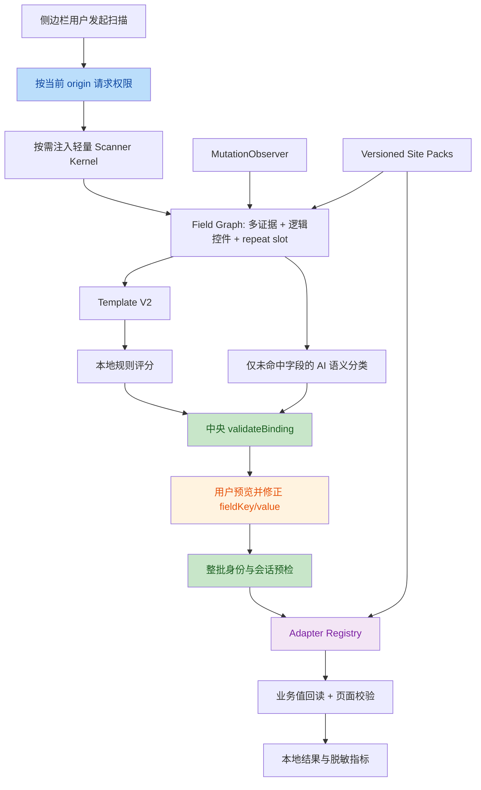

# 「来个简历自动填写助手」v0.7.14 智能填写竞品分析

> 分析日期：2026-08-04
> 分析对象：Edge 扩展 `njcfmofnddkdddogcdhmniiakcoiabmb`，版本 `0.7.14`
> 对比对象：当前工作区「猎投」智能填充实现
> 分析方式：只读静态分析；未加载、运行或修改第三方扩展
> 结论可信度：核心调用链与风险项均有静态证据；7 项第三方风险经两个独立审查线程复核，7/7 确认

## 1. 结论摘要

### 1.1 核心判断

第三方插件并不是依靠一个纯前端“智能识别算法”完成填写，而是采用了以下混合架构：

1. 客户端扫描页面控件，提取标签、属性、上下文、XPath 和精简 DOM 片段。
2. 服务端先按站点配置/XPath 返回 `页面字段 token -> 简历数据路径`。
3. 对未命中的字段再调用 AI 语义匹配。
4. 客户端按简历路径取值，通过 77 个 Trigger 适配器执行具体控件操作。
5. 填写后回读页面值，按 exact/approximate/failed 分类。
6. 动态表单最多自动扫描三轮，之后继续监测新增字段并提示“继续填写”。

它的主要壁垒不是单一字段分类模型，而是：

- 14 组、176 个简历字段的数据模型；
- 服务端可更新的站点语义配置和表单分组配置；
- 77 个组件/站点 Trigger 组成的执行适配层；
- 运行指标、失败原因、人工定位反馈构成的迭代闭环。

### 1.2 与「猎投」的总体差异

| 维度 | 第三方 v0.7.14 | 猎投当前智能填充核心 |
|---|---|---|
| 产品策略 | 点击后尽量自动完成，失败后处理 | 填写前预览、修改、勾选，再执行 |
| 覆盖广度 | 77 个 Trigger，覆盖大量组件库和招聘站 | 原生控件 + Ant Design + Element 为主 |
| 字段模型 | 176 个字段，云端 schema 可更新 | 79 个规范字段，本地代码维护 |
| 字段识别 | 服务端 XPath 快速映射 + AI 未命中兜底 | 本地多证据评分 + 可选 AI 分类 |
| 执行安全 | 回读校验强，但缺少统一扫描会话不变量 | scan/document/form/field 指纹 + 重复目标拦截 |
| 用户控制 | 直接开始/继续填写，较少填前审核 | 字段语义和值均可在填前人工修正 |
| 隐私边界 | 云简历、页面快照、部分简历值发送到自有服务 | 按站点授权；字段匹配 AI 不发送简历值 |
| 权限 | `<all_urls>` 常驻注入 | 目标站点按需申请可选权限、按需注入 |
| 模板学习 | 服务端语义配置、定位证据和统计闭环 | 本地 Template V2，只保存语义映射 |

最合理的优化方向不是复制第三方的全站注入和云端强依赖，而是：

> 保留猎投现有的按需权限、中央绑定校验、填前预览和 Template V2，在其上增加可插拔 Adapter Registry、Site Pack、MutationObserver 增量扫描和隐私受控的失败反馈闭环。

### 1.3 当前工作区的重要基线问题

当前工作区包含大量未提交改动。智能填充核心代码仍存在，但产品入口已被未提交改动移除：

- [`panel.html`](../panel.html) 已删除“智能填充”标签页及所有相关 DOM。
- [`src/app.js`](../src/app.js#L1-L27) 已移除 `fill-ui.js` 导入。
- [`src/app.js`](../src/app.js#L212-L220) 已移除 `initFillUi()` 调用。
- [`package.json`](../package.json#L7-L18) 的 `check` 已不再检查智能填充模块，并移除了直接声明的 `jsdom`。

验证结果：

- 智能填充专项测试：`116/116` 通过。
- 全量测试：`215/230` 通过，15 项失败。
- 其中 3 项直接来自智能填充面板入口缺失，其余失败来自当前批量投递/配置相关未提交改动。
- `npm run check` 通过，但当前脚本未覆盖 `fill-content.js`、`fill-ui.js`、`matcher.js` 等智能填充模块。
- `npm run build` 通过。

因此，当前状态应描述为：

> 智能填充“核心引擎可用、专项回归通过”，但“当前工作区产品入口不可用、全量基线非绿色”。

## 2. 分析范围与证据说明

### 2.1 第三方文件清单

| 文件 | 大小 | 作用 |
|---|---:|---|
| `content-scripts/content.js` | 733,181 B，gzip 约 198 KB | React UI、字段扫描、服务端映射、77 个 Trigger、填写与回读 |
| `background.js` | 45,844 B | 认证、API 代理、MAIN world 注入、登录同步 |
| `chunks/popup-DODWlTQL.js` | 353,113 B | 登录、云简历选择、配置与更新提示 |
| `chunks/options-Cgl-LZAs.js` | 4,705 B | 禁用网站、排除字段管理 |
| `help.html` | 7,003 B | 首次使用说明与产品文案 |
| `manifest.json` | 1,701 B | MV3 权限、全站注入、外部连接配置 |

第三方 JavaScript 均为单行压缩产物且无 source map。分析时使用本地 Terser 仅做格式化，未执行代码。报告不复制其大段实现，证据以原文件、唯一函数/字符串锚点和格式化后的行号记录。

第三方核心文件 SHA-256：

| 文件 | SHA-256 |
|---|---|
| `manifest.json` | `92279e338017910b3585d9fe08d9d9faa237ffaa332a246afc22790cb0db00ce` |
| `background.js` | `a5c85f5bf43c407cd9bece1a7d8844c12b54ce40e7ca22a38d33b37c64655558` |
| `content.js` | `7f966e57ac08238bdf5633867f95ebef4af3df8bc04b4def30f6819d22baeacc` |

### 2.2 已证实与推断边界

已证实：

- 页面候选字段如何扫描、过滤、编号和序列化。
- 两阶段 `mode=xpath -> mode=ai` 映射流程。
- 简历本地缓存、云端同步与选择逻辑。
- Trigger 注册表、回退路径、回读校验和增量轮次。
- 发送到后端的字段和统计 payload。

无法仅靠客户端证实：

- 服务端模型、提示词、数据库结构和 XPath 配置生成算法。
- 服务端是否二次脱敏、保存多久、是否用于训练。
- 线上成功率、真实覆盖站点数和用户规模。

## 3. 第三方整体架构



### 3.1 分层职责

| 层 | 主要职责 | 关键证据锚点 |
|---|---|---|
| UI 层 | 浮动按钮、开始/继续、进度、结果、反馈、简历信息 | `class hu`、React 组件 `uc` |
| 候选扫描层 | 控件召回、可见性/只读/上传过滤、逻辑 root 去重 | `Ri`、`zi()`、`Fo()` |
| 上下文层 | token、XPath、selector、标签、分组、表格列、DOM 片段 | `Bo()`、`Po()`、`Yo()` |
| 映射层 | token 到简历路径的 XPath 快速映射和 AI 映射 | `getNeedFieldV2`、`mode: "xpath"`、`mode: "ai"` |
| 数据层 | 简历路径解析、数组索引、组合路径、派生字段 | `class Q` |
| 执行层 | 77 个 Trigger、原生输入、MAIN world 框架调用 | `xi`、`Ci()`、`class Al` |
| 验证层 | 页面值回读、exact/approximate/failed | `getFillMatchStatus()` |
| 运营层 | 统计、反馈、人工定位证据、站点配置 | `/ai/fill-stats`、`/ai/manual-locator-evidence` |

## 4. 核心表单检测算法

### 4.1 候选控件召回

插件不是只扫描 `input/select/textarea`，而是维护了一个较大的候选选择器集合，主要包括：

- 原生文本、邮箱、电话、数字、日期、radio、textarea、select；
- `contenteditable`；
- Ant Design：select、picker、radio、cascader；
- Element：select、autocomplete、cascader、date editor；
- Moka `sd-*` 控件；
- VUX、iView、LayUI、Kuma、ATSX、Phoenix、飞书表单等自定义组件；
- 站点特有的 `select-box`、`date-picker`、`hc-super-selector` 等组件。

召回后依次执行：

1. 排除隐藏、按钮、文件上传和零尺寸控件。
2. 排除 disabled/readonly，但对白名单自定义只读组件保留。
3. 将内部 input 归并到外层逻辑组件 root。
4. 排除候选集合中被另一个候选祖先完整包含的重复节点。
5. 对智联、OPPO、工行、51job 等站点执行额外去重策略。

这套策略比单纯的 CSS 选择器扫描更接近“逻辑控件扫描”。

### 4.2 字段语义证据

每个候选会生成一个 token，例如 `###1`，并提取：

```text
token
xpath
selector
tag
inputType
label
placeholder
name
id
required
contextText
```

标签来源包括显式 label、placeholder、name/id、组件文本、邻近标题和表格列上下文。对于重复经历，额外构建：

```text
section
groupOrdinal
column
```

服务端可下发表单分组配置：

```text
sectionTitleSelector
fieldGroupSelector
existingGroupSelector
groupOrder
rewriteIndexByGroup
```

这使“第 2 条教育经历的学校”能够映射到带索引的简历路径，而不是只识别成通用“学校”。

### 4.3 DOM 片段构造

插件会：

1. 找到候选字段的共同祖先。
2. 临时给候选节点写入 locator token。
3. 克隆共同祖先 DOM。
4. 清理脚本、样式和无关节点。
5. 生成 `html_fragment`、`simple_fragment`、`element_dict` 和 `token_context`。
6. 请求结束前移除页面上的临时 token 属性。

后端请求包含：

```text
mode
title
url
html_fragment
simple_fragment
element_dict
token_context
rewrite_index_by_group
candidate_count
unmatchedTokens
forceSnapshot
```

重要边界：

- 字段映射请求没有直接携带完整 `resumeData`。
- 但它会携带当前页面 URL、标题、表单 DOM 片段及字段语义。
- 后续 `fillSelector` 候选选择请求会携带具体 `resumeValue`。

### 4.4 两阶段字段匹配

单轮流程如下：

1. `mode: "xpath"`：服务端优先使用站点配置/定位规则返回已知映射。
2. 将返回的 `{ token, mapping, source }` 绑定回真实 DOM 元素。
3. 立即开始填写快速命中字段。
4. 同时对 `unmatchedTokens` 发起 `mode: "ai"` 请求。
5. 快速字段填完后等待 AI 结果，再填剩余字段。

这是一个有效的性能设计：慢速 AI 与本地执行重叠，而不是串行等待全部分析完成。

### 4.5 简历路径解析

服务端返回的不是最终值，而是简历路径，例如：

```text
personal.name
education[1].school
work_experience[2].company
start_date - end_date
```

本地 `class Q` 负责：

- 去除模板大括号；
- 读取对象路径；
- 支持数组路径；
- 支持 ` - `、` ~ `、` / ` 组合路径；
- 格式化字符串、数字、布尔和简单对象；
- 根据“是否/有无”标签派生“是/否”；
- 将“至今/现在”转换为当前日期。

该设计将“语义映射”和“简历值读取”分离，便于站点配置复用。

## 5. 自动填充执行算法

### 5.1 Trigger Registry

代码中可静态识别 77 个 Trigger，按 `match -> handler` 注册，包括：

- 通用：NativeSelect、CheckboxInput、RadioGroup、FallbackInput；
- Ant Design：Select、Cascader、DatePicker、DateRangePicker；
- Element：Select、Autocomplete、Cascader、DatePicker；
- Moka：SdInput、SdDropdown、地区、搜索、单月、月份范围；
- 站点：智联校园、BOSS 校招、51job、比亚迪、美团、OPPO、国聘、拉勾、实习僧、交通银行、理想、东航等；
- 框架：VUX、iView、LayUI、Kuma、ATSX、Phoenix、飞书 `ud__select`。

统一 Trigger 返回契约可抽象为：

```ts
{
  handled: boolean;
  finalElement: HTMLElement | null;
  strategy?: string;
  effectiveValue?: string;
  preventFallback?: boolean;
  message?: string;
}
```

### 5.2 执行顺序

1. 按站点规则排序字段；例如比亚迪证件号延后填写。
2. 聚焦并滚动到目标字段。
3. 顺序匹配 77 个 Trigger。
4. Trigger 成功则返回最终元素。
5. 若所有 Trigger 未处理且未声明 `preventFallback`：
   - 先尝试原型 setter + `input/change` 的快速原生输入；
   - 再尝试通用输入兜底。
6. 读取实际显示值。
7. 判断 exact、approximate 或 failed。

### 5.3 框架内部调用

部分复杂站点在扩展隔离世界中仅靠 DOM 事件无法更新框架状态，因此 background 使用：

```text
chrome.scripting.executeScript({ world: "MAIN" })
```

访问页面侧的：

- Vue 2 `__vue__` 实例；
- React Fiber/props；
- 组件的 `onChangeCheck`、`onClickLabel`、`selectOptionClick`；
- VUX picker 的 `$emit`、`currentValue`；
- 比亚迪 Element/Vue cascader 的内部状态。

这是覆盖复杂控件的有效手段，但与站点实现高度耦合，应作为最后一级 Site Adapter，而不是通用默认路径。

### 5.4 候选选项匹配与预取

对于 select/cascader 的候选值：

1. 先做本地标准化、精确和相似度匹配。
2. 本地失败时请求 `/ai/fill-selector`。
3. 使用并发度 3 的预取器，在首轮填充时暖缓存。
4. 首轮因预取未完成而失败的字段，在请求完成后重试。

优点：

- 本地命中时无网络等待。
- 多个复杂下拉并行请求。
- 对失败字段而非全部字段重跑。

隐私代价：

- `fillSelector` 请求包含 `resumeValue/resumeFieldValue` 和页面候选文本。

### 5.5 回读与错误分类

执行后会读取：

- input/textarea/select 当前值；
- radio/checkbox checked 状态；
- 自定义下拉展示文本；
- 复合日期范围；
- 地区层级；
- 页面表单校验错误。

校验结果：

- `exact`：精确或语义等价；
- `approximate`：组件返回可接受的近似选项；
- `failed`：无值、不相似、校验错误或 Trigger 失败。

失败原因至少区分：

```text
NO_RESUME_DATA
FILL_EXECUTION_FAILED
ELEMENT_INVISIBLE
ELEMENT_DISABLED
STALE_LOCATOR
```

## 6. 动态表单与不同网站适配

### 6.1 增量填写

插件使用 `data-offernow-form-id` 标记已处理逻辑字段，单次用户操作最多自动执行三轮：

```text
全量候选 -> 填写 -> 等待 600 ms -> 扫描未标记候选 -> 再填
```

遇到 `STALE_LOCATOR` 时会：

1. 清除相关扫描标记；
2. 等待关联字段挂载；
3. 重新扫描和映射；
4. 在未超过三轮时继续。

智联校园还维护字段业务 key，对“现居住城市/现居住地”等同义标签做归一化，避免重复填写。

### 6.2 填写后的新增字段提示

成功后持续 60 秒，每 5 秒扫描一次新增字段；新增候选超过 4 个时显示“继续填写”提示。

产品思路正确，但实现使用轮询：

- 最多有约 5 秒发现延迟；
- 后台标签页可能被浏览器节流；
- 每轮再次执行 DOM 候选扫描。

更适合改为 `MutationObserver + debounce + 局部 subtree 扫描`。

### 6.3 适配机制分层

第三方实际上同时存在四类适配：

| 类型 | 示例 | 特点 |
|---|---|---|
| 通用组件适配 | Ant/Element/iView/VUX | 可跨站复用 |
| 域名级适配 | BYD、51job、智联、Moka | 处理站点特定结构 |
| 服务端站点配置 | semantic config、form grouping | 无需发版即可更新映射 |
| MAIN world 适配 | Vue/React 内部调用 | 成功率高、耦合度也最高 |

## 7. 简历数据存储与管理

### 7.1 数据模型

内置 schema 约 14 组、176 个字段，覆盖：

- 个人信息；
- 工作、教育、项目、实习；
- 技能、语言、证书；
- 家庭关系、干部经历；
- 求职意向；
- 获奖、专利、论文等。

相比猎投当前 79 个规范字段，第三方在国企、银行、制造业和校招表单上的长尾覆盖明显更完整。

### 7.2 云端与本地缓存

第三方以 `https://cv.playoffer.cn/api/user/resume-cloud` 为主数据源，支持：

- 多简历列表；
- 当前简历选择；
- `updatedAt` 版本判断；
- 完整度 `resumeCompleteness`；
- 缺失字段 `missingKeyFields`；
- 云端数据变化后刷新本地缓存。

本地 `chrome.storage.local` 主要键：

```text
offernow_resume_data
offernow_current_resume_selection
offernow_temp_resume_data
offernow_user_config
offernow_public_ai_config_cache_v2
offernow_resume_schema_cache
offernow_user_token
offernow_login_status
```

### 7.3 产品价值

- 用户可在网页端维护完整简历，扩展只负责选择和缓存。
- 填写前同步最新云端版本，降低扩展内数据陈旧。
- 简历完整度低于 30 时先阻止填写并引导完善资料。
- 当前简历失效、数据异常、云端空列表均有明确状态。

## 8. 产品体验分析

### 8.1 用户旅程



### 8.2 设计亮点

1. **开始/继续的单一主操作**

   动态表单不要求用户理解“重新扫描”，而是将动作表述为“继续填写”。

2. **填写前检查简历状态**

   云同步、当前简历选择、完整度和失效状态在开始前统一处理。

3. **进度状态具体**

   区分同步简历、分析页面、快速填写、AI 分析剩余字段、重新定位等阶段。

4. **结果不仅显示成功率**

   同时展示缺少简历数据的字段、预计节省时间、失败字段和下一步动作。

5. **站点级控制**

   支持本次隐藏浮动按钮、永久禁用当前网站、管理禁用网站。

6. **全局排除字段**

   用户可配置“推荐码/邀请码/内推码”等不希望自动填写的字段。

7. **反馈闭环**

   将“缺少字段”“应填未填”“实际填错”等原因结构化收集。

### 8.3 产品问题

1. **填前控制不足**

   主流程偏向“先执行，再看结果”，用户看不到完整的“页面字段 -> 简历字段 -> 目标值”计划。对于身份证、家庭信息、政治面貌等敏感字段，填前预览更合适。

2. **隐私文案与实现不一致**

   `help.html` 宣称“数据仅存储在本地”，但实际存在云端简历、页面快照上传、具体简历值的候选匹配请求和统计上报。

3. **全站浮动按钮干扰**

   `<all_urls>` 使插件出现在与求职无关的页面。虽然支持隐藏，但默认权限和默认可见性仍过宽。

4. **云端强依赖**

   未登录、云同步异常或字段映射服务不可用时，主流程明显受限。

5. **部分 UI 暴露实现细节**

   “Agent”“XPath”“Trigger”等内部概念出现在包内调试/管理工具中。即使普通用户不一定能进入，也说明生产包仍携带较多开发和管理能力。

## 9. 第三方与猎投的产品对比

| 产品维度 | 第三方 v0.7.14 | 猎投当前设计 | 建议 |
|---|---|---|---|
| 入口 | 页面浮动按钮，随处可见 | 侧边栏智能填充页 | 保留侧边栏；授权后可增加轻量页面入口 |
| 主流程 | 一键开始，自动执行 | 扫描 -> 预览 -> 勾选 -> 填写 | 保留预览，增加“高置信快速填”可选模式 |
| 简历管理 | 云端多简历、完整度、缺失项 | 本地 profile + 结构化字段 | 增加完整度和缺失字段提示，不必强制上云 |
| 动态经历 | 最多三轮自动增量 | 用户显式“展开简历经历” | 保留显式新增，填后自动检测新增字段 |
| 失败恢复 | 继续填写、重试、侧边栏人工处理 | 失败字段高亮、可重扫 | 增加“只重试失败项”和状态原因分组 |
| 用户纠错 | 失败后人工选择字段/输入框 | 填前可改 fieldKey 和 value | 猎投更优；应继续作为核心差异化 |
| 完成反馈 | 成功数、缺失数、节省时间、反馈 | 成功/失败与历史日志 | 增加耗时、节省时间、失败原因摘要 |
| 站点控制 | 当前站隐藏、永久禁用、字段排除 | 按站点授权 | 增加字段排除和站点禁用列表 |
| 隐私表达 | 文案与真实数据流不一致 | 明确 AI 数据边界 | 保持真实、可验证、分场景说明 |

## 10. 技术架构对比

| 技术维度 | 第三方 v0.7.14 | 猎投当前核心 | 判断 |
|---|---|---|---|
| 注入方式 | `<all_urls>` 自动注入 733 KB | 用户授权后按需注入，生产内核约 38 KB、gzip 约 12 KB | 猎投更轻、更克制 |
| 候选扫描 | 大选择器集合 + 逻辑 root 去重 | 原生 + Ant/Element 逻辑控件 | 第三方覆盖广 |
| 语义证据 | label/属性/context/XPath/DOM/token | 多证据加权、section/group/repeat | 两者接近，猎投本地可解释性更强 |
| 字段映射 | 服务端 XPath + AI | Template V2 + 本地规则 + AI | 第三方学习快，猎投隐私和离线能力更强 |
| AI 输入 | 页面快照；部分阶段含简历值 | 字段匹配只发页面元数据 | 猎投边界更安全 |
| 简历路径 | 服务端 mapping + 本地路径解析 | ValueRef + 数组路径 | 架构思想相似 |
| 执行器 | 77 Trigger + MAIN world | native/Ant/Element 通用适配 | 第三方显著领先 |
| 字段身份 | 主要依赖本轮元素、XPath和少量站点重验 | 字段指纹、多定位器、会话指纹、重复目标拦截 | 猎投更严格 |
| 中央校验 | 取值与回读分散在 FormFiller/Trigger | 规则、模板、AI、人工统一 `validateBinding` | 猎投更安全 |
| 动态表单 | 自动最多三轮 + 填后轮询 | 显式新增经历 + MutationObserver 标脏 | 可组合两者优点 |
| 回读 | exact/approximate/failed，站点语义归一 | 业务值回读 + 目标指纹 | 第三方结果表达更丰富 |
| 模板 | 服务端站点配置 | 本地 Template V2，无具体 PII | 猎投隐私更好 |
| 可观测性 | 细粒度耗时、失败原因、反馈和定位证据 | 本地日志和进度 | 第三方更成熟 |
| 测试 | 生产包无法看到测试 | 116 项专项测试通过，6 个夹具全链路 | 猎投可验证性更好 |

## 11. 风险与工程问题

两个独立审查线程逐项核验了以下 7 项第三方风险，全部确认存在。

| No. | 严重度 | 结论 | 证据 | 建议 |
|---:|---|---|---|---|
| 1 | 高 | “仅本地存储”文案与云同步、页面快照、`fillSelector` 发送简历值矛盾 | `help.html:77-78`；`Po()`；`tu()`；background `fillSelector` | 建立真实数据清单，按场景披露字段、目的、保存时间和第三方 |
| 2 | 中 | `<all_urls>` 常驻约 733 KB，扩大读取能力和性能影响面 | `manifest.json`、`pu.matches`、`class hu` | 改为按需授权和按需注入；未触发时不读取页面业务内容 |
| 3 | 低 | `localhost:3010` 同时出现在主机权限和外部连接配置，但运行时不接受 localhost 来源 | `manifest.json`、`onMessageExternal` | 发布流程增加 Manifest 环境校验，正式包禁止本地地址 |
| 4 | 中 | `getNeedFieldV2` 和 `resume-cloud` 无明确请求超时，核心流程可能长期等待 | background timeout map、`tu()` | 所有请求统一 AbortController、超时码和可取消 UI |
| 5 | 中 | 77 个 Trigger 大量依赖固定类名、Vue/React 内部对象和 MAIN world | `xi`、PAGE_CONTEXT 消息 | 适配器版本化、契约测试、站点 canary 和快速降级 |
| 6 | 低 | 新字段检测每 5 秒轮询 60 秒，受后台节流且有发现延迟 | `NEW_FIELDS_DETECTION_*` | 改用 MutationObserver，轮询仅作低频兜底 |
| 7 | 中 | `FormFiller.isElementVisible()` 只检查 `parentNode`，运行时可见性判断不足 | `class Al` | 填写前复用真实可见性、可交互性和遮挡检查 |

必须避免的误读：

- 没有证据表明扩展在用户未启动填写时自动上传完整表单。
- 已证实的是：它在所有页面具备读取能力，并在初始化时读取部分页面特征；用户启动填写后会上传表单语义和 DOM 片段。
- `localhost` 是过宽且无效的发布残留，当前证据不足以称为可利用的外部消息漏洞。

## 12. 值得复用的技术方案

### 12.1 可插拔执行适配器

将猎投现有 native/Ant/Element 逻辑抽成统一接口：

```ts
interface FillAdapter {
  id: string;
  priority: number;
  canHandle(context: FillContext): number;
  fill(context: FillContext): Promise<FillOutcome>;
  read(context: FillContext): Promise<ObservedValue>;
}
```

约束：

- `canHandle` 返回分数，不使用隐式数组顺序决定唯一胜者。
- `fill` 必须返回最终元素、策略名、有效值和是否允许 fallback。
- `read` 与 `fill` 分离，禁止仅凭事件已派发判定成功。
- MAIN world 适配器必须单独声明权限和风险等级。

### 12.2 快慢双通道映射

建议顺序：

```text
Template V2 -> 高置信本地规则 -> 用户历史确认 -> AI 未命中兜底
```

可借鉴第三方的并行策略：

- 高置信字段立即进入预览或执行准备；
- AI 只分析未命中字段；
- AI 结果回来后增量更新列表；
- 不阻塞本地结果展示。

不可照搬：

- AI 字段匹配不得接收简历具体值。
- 选项匹配优先使用本地规范化和同义词表。
- 确需远端候选选择时，应只发送值类别或不可逆特征，并允许用户关闭。

### 12.3 Site Pack

建议将站点适配从大文件条件分支拆成版本化数据：

```ts
interface SitePack {
  id: string;
  hostPatterns: string[];
  routePatterns: string[];
  fieldRoots: string[];
  groupRules: GroupRule[];
  adapterOrder: string[];
  exclusions: string[];
  version: number;
}
```

首批只覆盖高价值站点：

1. Moka；
2. 北森；
3. 智联校园；
4. 51job；
5. 米哈游/大易类 Ant 表单。

### 12.4 MutationObserver 增量引擎

建议流程：

```text
观察 form root
  -> 收集新增/变化 subtree
  -> 80~150 ms debounce
  -> 仅扫描变化子树
  -> 生成新 FieldDescriptor
  -> 与已处理 business key 去重
  -> 更新预览或提示继续填写
```

保留最多三轮的安全上限，避免表单联动循环。

### 12.5 失败原因与观测

统一结果模型：

```ts
type FillFailureReason =
  | "NO_RESUME_DATA"
  | "LOW_CONFIDENCE"
  | "STALE_SCAN"
  | "STALE_TARGET"
  | "DUPLICATE_TARGET"
  | "ELEMENT_INVISIBLE"
  | "ELEMENT_DISABLED"
  | "OPTION_NOT_FOUND"
  | "VALIDATION_REJECTED"
  | "ADAPTER_TIMEOUT"
  | "USER_CANCELLED";
```

默认只保存在本地。用户主动提交反馈时：

- 删除姓名、手机号、邮箱、身份证和目标值；
- 只发送站点、控件类型、适配器、错误码和脱敏结构摘要；
- 提交前展示 payload。

## 13. 猎投目标架构



目标原则：

1. 未授权不注入。
2. AI 分类不接收简历值。
3. 任何来源的映射都经过中央校验。
4. 任何执行都经过字段身份和会话预检。
5. 无法唯一确认时失败关闭，不追求虚假 100% 成功率。
6. 站点适配以插件包内版本化数据为主，远端配置不是首要依赖。

## 14. 分阶段实施路线图

### P0：恢复可交付基线

目标：先保证当前功能可进入、可测试、可发布。

1. 恢复 `panel.html` 智能填充标签页和 `src/app.js` 的 `initFillUi()`。
2. 恢复 `package.json` 版本与 `manifest.json` 一致。
3. 恢复 `jsdom` 直接开发依赖。
4. 将所有智能填充模块重新纳入 `npm run check`。
5. 修复当前 15 项全量测试失败，达到 `230/230`。

验收：

- 侧边栏可完成扫描、预览、修正、填充、停止和重扫。
- `npm run check && npm test && npm run build` 全绿。

### P1：执行适配器工程化

目标：将覆盖范围从“少量通用组件”提升为可持续扩展。

1. 抽取 Adapter Registry。
2. 将现有 native/Ant/Element 实现迁入适配器。
3. 新增 cascader、autocomplete、range date、virtual select 四类通用适配器。
4. 每个适配器建立契约测试：匹配、执行、回读、超时、fallback。
5. 所有异步适配器支持 `AbortSignal`。

验收：

- 适配器失败不会绕过中央校验。
- 任何 fallback 都必须通过业务值回读。
- 单适配器故障不影响其他字段。

### P1：动态表单增量扫描

目标：减少用户重复点击“扫描”。

1. `MutationObserver` 监听当前 form root。
2. 对新增 subtree 做局部扫描。
3. 使用业务 key 和字段指纹去重。
4. 高置信新增字段进入“继续填写”预览，不直接静默写入。
5. 最多三轮自动处理。

验收：

- DOM 新增后 300 ms 内更新提示。
- 后台标签页不依赖高频 timer。
- 不重复填已确认字段。

### P2：字段模型与 Site Pack

目标：补齐校招和国企长尾字段。

1. 基于真实失败日志扩展 79 个字段，而不是一次性照搬 176 个字段。
2. 优先加入家庭关系、语言证书、获奖、论文、专利等常见模块。
3. 为 Moka、北森、智联、51job 建立 Site Pack。
4. 支持 section/group/existing group 和 repeat index。

验收：

- 12 个站点夹具；
- 常见字段规则命中率 >= 95%；
- 总体字段命中率 >= 88%；
- 重复经历不允许错误复用第一条数据。

### P2：结果与纠错体验

目标：吸收第三方产品优势，同时保留填前控制。

1. 增加“只重试失败项”。
2. 按失败原因聚合结果。
3. 显示实际自动填写耗时和估算节省时间。
4. 增加站点禁用和全局排除字段。
5. 人工纠正后只保存语义映射，不保存 PII。

### P3：隐私受控学习闭环

目标：让真实失败数据推动适配，而不建立不透明数据采集。

1. 默认本地保存适配器成功率和失败码。
2. 用户主动提交时预览脱敏 payload。
3. 后台生成候选 Site Pack，必须经测试和版本审核后随扩展发布。
4. 不允许远端配置绕过本地中央校验。

## 15. 建议优先级

| 优先级 | 建议 | 用户价值 | 工程成本 | 风险 |
|---|---|---:|---:|---:|
| P0 | 恢复智能填充入口与绿色测试基线 | 极高 | 低 | 低 |
| P1 | Adapter Registry + 四类通用复杂控件 | 极高 | 中 | 中 |
| P1 | MutationObserver 增量扫描 | 高 | 中 | 低 |
| P1 | 统一请求超时、取消和错误码 | 高 | 低 | 低 |
| P2 | 站点 Site Pack | 高 | 中高 | 中 |
| P2 | 完整度、失败摘要、只重试失败项 | 中高 | 中 | 低 |
| P2 | 字段 schema 按真实数据扩展 | 中高 | 中 | 低 |
| P3 | 脱敏反馈闭环 | 中 | 中高 | 中 |

## 16. 最终建议

第三方最值得借鉴的是：

1. Trigger/Adapter 注册表；
2. 快速映射与 AI 未命中兜底并行；
3. 逻辑控件 root、重复分组和业务 key；
4. exact/approximate/failed 回读模型；
5. 动态表单“继续填写”；
6. 简历完整度、失败原因和反馈闭环。

不应借鉴的是：

1. `<all_urls>` 常驻大包；
2. “仅本地”但实际上云的模糊隐私表达；
3. 字段匹配或候选选择发送具体简历值；
4. 无填前审核的默认自动执行；
5. 以 MAIN world 和框架私有属性作为通用方案；
6. 发布包保留 localhost 权限和开发/管理工具。

猎投现有中央校验、会话指纹、Template V2、按需授权和人工预览是正确基础。短期最关键的动作不是继续扩字段，而是先恢复当前产品入口和绿色基线，再把现有执行代码重构成可扩展适配器体系。

## 17. 证据索引

### 第三方原包

```text
~/Library/Application Support/Microsoft Edge/Default/Extensions/
  njcfmofnddkdddogcdhmniiakcoiabmb/0.7.14_0/
```

| 结论 | 文件/锚点 |
|---|---|
| 全站注入 | `manifest.json -> content_scripts.matches = <all_urls>` |
| localhost 残留 | `manifest.json -> host_permissions / externally_connectable` |
| 本地存储文案 | `help.html:77-78` |
| API 清单 | `background.js -> AI_PARSE_RESUME_V2_URL / AI_FILL_SELECTOR_URL / RESUME_CLOUD_URL` |
| 映射请求 | `background.js -> case "getNeedFieldV2"` |
| 候选选择值上传 | `background.js -> case "fillSelector"` |
| 候选扫描 | `content.js -> Ri / zi() / Fo()` |
| token DOM payload | `content.js -> Po()` |
| 简历路径读取 | `content.js -> class Q` |
| Trigger Registry | `content.js -> xi` |
| Trigger 调度 | `content.js -> Ci()` |
| 填写器 | `content.js -> class Al` |
| 增量流程 | `content.js -> runIncrementalFillRound / run来个简历Flow` |
| 云简历 | `content.js -> tu() / refreshResumeCacheFromCloud()` |

### 猎投当前实现

| 结论 | 证据 |
|---|---|
| 多证据扫描 | [`fill-content.js:380-465`](../fill-content.js#L380-L465) |
| 字段描述符与逻辑控件 | [`fill-content.js:558-703`](../fill-content.js#L558-L703) |
| 会话与字段指纹 | [`fill-content.js:793-819`](../fill-content.js#L793-L819) |
| 填充前整批预检 | [`fill-content.js:1348-1388`](../fill-content.js#L1348-L1388) |
| 统一执行和回读 | [`fill-content.js:1391-1471`](../fill-content.js#L1391-L1471) |
| 中央绑定校验 | [`src/matcher.js:369-420`](../src/matcher.js#L369-L420) |
| 多证据规则评分 | [`src/matcher.js:422-550`](../src/matcher.js#L422-L550) |
| AI 只返回 fieldKey | [`src/matcher.js:553-609`](../src/matcher.js#L553-L609) |
| Template V2 不保存值 | [`src/site-templates.js:20-50`](../src/site-templates.js#L20-L50) |
| 按站点授权 | [`src/fill-ui.js:315-354`](../src/fill-ui.js#L315-L354) |
| 填前预览和修正 | [`src/fill-ui.js:547-585`](../src/fill-ui.js#L547-L585) |
| 填写前二次校验 | [`src/fill-ui.js:591-644`](../src/fill-ui.js#L591-L644) |
| 当前入口缺失 | [`src/app.js:1-27`](../src/app.js#L1-L27)、[`panel.html`](../panel.html) |
